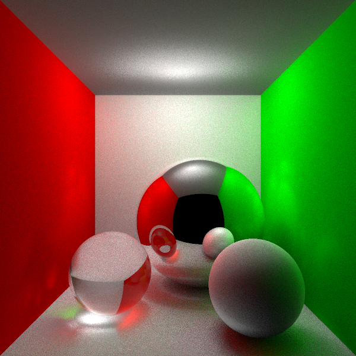

# PyTracer

## Ray tracing with Python3 / PyQt5 / numpy

* Ray Tracing Features:
  * Geometry:
    * Sphere intersection [✓]
    * Plane intersection [✓]
    * Cube Intersection
    * Triangle intersection [✓]
    * Quad intersection [✓]

  * Camera:
    * Camera exposure

  * Light:
    * Point light [✓]
    * Area light [Disk light working]
    * Radiance unit

  * Material:
    * Diffuse / Lambert [✓]
    * Mirror [✓]
    * Glossy
    * Glass

  * Core:
    * Camera Ray [✓]
    * Shadow Ray / Direct Lighting [✓]
    * Render Equation integration
    * Recursive tracing [only first pass]

  * Optimization:
    * multiprocessing [✓]
    * Anti-aliasing [Need improvement]

  * Imaging:
    * Gamma Correction [✓]

* GUI Features:
  * Render Window [✓]
  * Bucket Render [Need improvement]
  * Real-time update [✓]
  * multiprocessing [✓]
  * Separate thread for window [✓]
  * Render time calculation [✓]
  * Interactive Render
